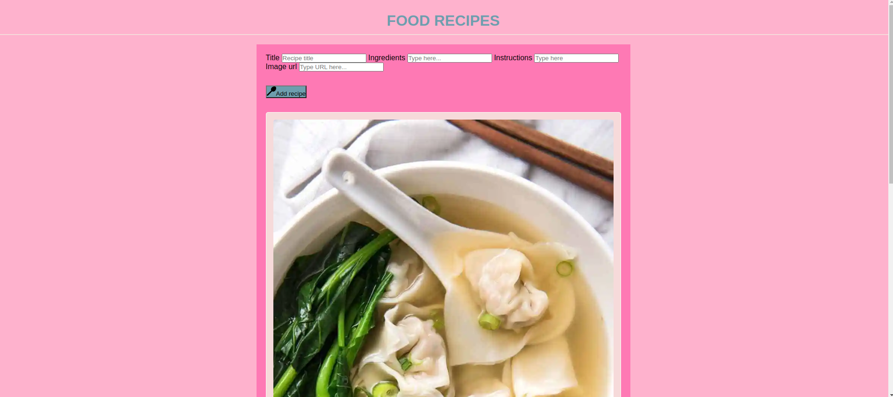
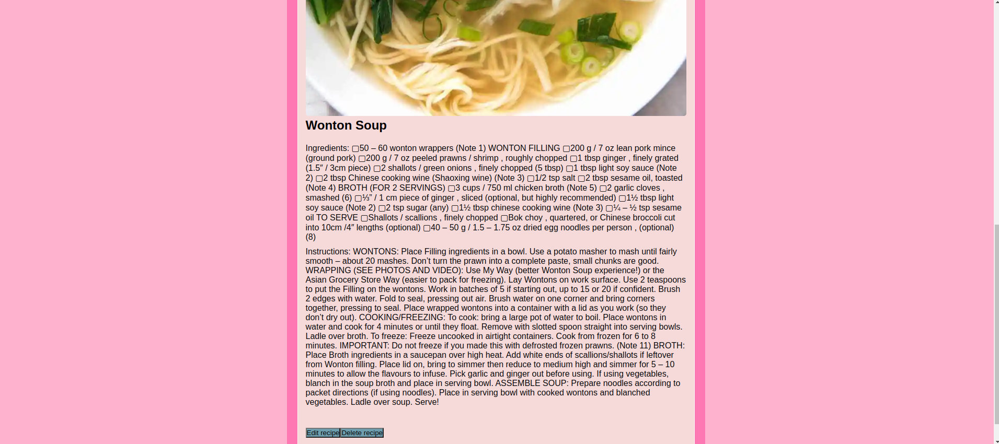

# Food Recipes

  > The Food Recipe Project is a web application, enable users to add new recipes, edit existing ones, and delete recipes they no longer need. Additionally, the application can fetch recipe data from an external API and render it dynamically into the Document Object Model (DOM) using modern JavaScript features, including asynchronous functions, API calls, and event handlers. The project is structured with a clear separation of concerns, utilizing different modules for API interactions, event handling, and asynchronous operations.
  

## Set up

### Front end

```bash
cd frontend
npm i
```

### Back end

```md
url = 'http://localhost:5002'
```

```bash
npm install -g nodemon
```

```bash
cd backend
npm i
npm run dev
```

### Screenshots

 
 

### Technologies

- JavaScript
- HTML5
- CSS3
- VSC code
- Mongodb
- Node
  
### Features

Key Features:

Add Recipes:

Users can input details about a new recipe (e.g., title, ingredients, instructions). The new recipe is saved to the application’s data store.

Edit Recipes:

Users can modify details of existing recipes.
Changes are updated in the application’s data store.

Delete Recipes:

Users can remove recipes from their collection.
The selected recipe is deleted from the application’s data store.

Fetch Data from an API:

The application can make requests to an external API to retrieve recipe data. Fetched data is rendered dynamically into the DOM.

### Status

Project is: _Completed_